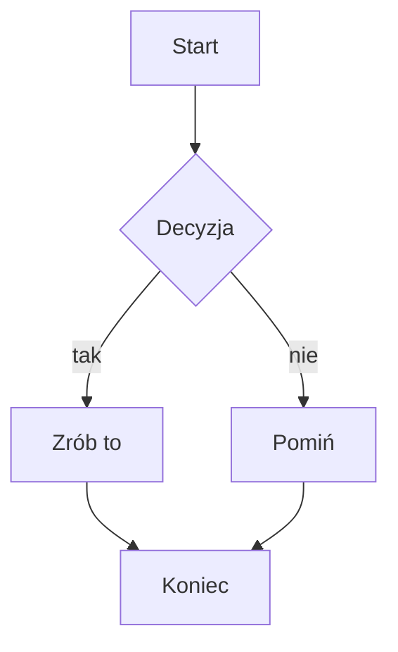
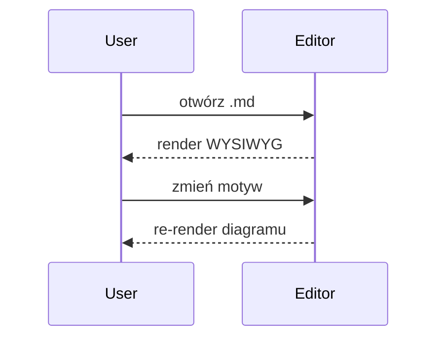
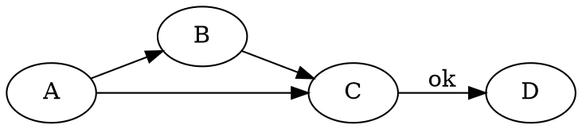
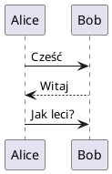

# vMarkd — wszystkie renderery

Plik demonstracyjny: każdy renderer Vditora + matematyka + podświetlanie kodu.
Otwórz w vMarkd i przełączaj `vmarkd.theme.content` / `vmarkd.theme.mermaid`,
żeby zobaczyć, co podąża za motywem, a co ma zaszyte kolory.

---

## 1. Tekst + inline code + podświetlanie składni

Zwykły akapit z `inline code` i **pogrubieniem**. Bloki kodu kolorowane przez
highlight.js (sparowane z motywem treści):

```js
function greet(name) {
  const msg = `Hello, ${name}!`
  return msg.toUpperCase()
}
```

```python
def fib(n):
    a, b = 0, 1
    for _ in range(n):
        a, b = b, a + b
    return a
```

> Cytat blokowy — sprawdza tło/bordery blockquote z palety motywu.

---

## 2. Matematyka (KaTeX) — dziedziczy `currentColor`

Inline: $E = mc^2$ oraz $\sum_{i=1}^{n} i = \frac{n(n+1)}{2}$.

Blok:

$$
\int_{-\infty}^{\infty} e^{-x^2}\,dx = \sqrt{\pi}
$$

---

## 3. Mermaid — pełne parowanie palety (task 86)





---

## 4. ECharts — śledzi binarnie dark/light (własny motyw 'dark')

```echarts
{
  "title": { "text": "ECharts demo" },
  "tooltip": {},
  "xAxis": { "type": "category", "data": ["Pon","Wt","Śr","Czw","Pt"] },
  "yAxis": { "type": "value" },
  "series": [{ "type": "bar", "data": [5, 20, 36, 10, 12] }]
}
```

---

## 5. Mindmap (ECharts tree) — wejście to URL-encoded JSON

```mindmap
%7B%22name%22%3A%22vMarkd%22%2C%22children%22%3A%5B%7B%22name%22%3A%22Renderery%22%2C%22children%22%3A%5B%7B%22name%22%3A%22mermaid%22%7D%2C%7B%22name%22%3A%22math%22%7D%5D%7D%2C%7B%22name%22%3A%22Motywy%22%7D%5D%7D
```

---

## 6. Markmap — wejście to markdown outline (ignoruje motyw)

```markmap
# Root
## Gałąź A
- liść 1
- liść 2
## Gałąź B
- liść 3
### Pod-gałąź
- liść 4
```

---

## 7. flowchart.js — bez motywu (zaszyty czarny)

```flowchart
st=>start: Start
op=>operation: Zrób coś
cond=>condition: Tak czy nie?
e=>end: Koniec
st->op->cond
cond(yes)->e
cond(no)->op
```

---

## 8. Graphviz / Viz.js — DOT, bez motywu



---

## 9. PlantUML — ZDALNY obraz z plantuml.com (może być blokowany przez CSP object-src)



---

## 10. abc.js — notacja muzyczna ABC (bez motywu)

```abc
X:1
T:Gama C-dur
M:4/4
L:1/4
K:C
C D E F | G A B c |
```

---

## 11. smiles-drawer — struktura chemiczna (śledzi binarnie dark)

Kofeina:

```smiles
CN1C=NC2=C1C(=O)N(C(=O)N2C)C
```

---

## 12. Tabela + lista zadań (palette content-theme)

| Renderer | Śledzi motyw? | Mechanizm |
|----------|:-------------:|-----------|
| math (KaTeX) | ✅ | dziedziczy `currentColor` |
| mermaid | ✅ | paleta (task 86) |
| ECharts | ◑ | binarne dark/light |
| smiles | ◑ | binarne dark/light |
| markmap | ❌ | zaszyte |
| graphviz | ❌ | zaszyte |
| flowchart | ❌ | zaszyte |
| abc | ❌ | zaszyte |
| plantuml | ❌ | zdalny obraz |

- [x] math
- [x] mermaid
- [ ] reszta — do oceny wizualnej

---

## 13. Callouts / GitHub Alerts (task 106)

5 typów GitHub:

> [!NOTE]
> Przydatna informacja, na którą użytkownik powinien zwrócić uwagę.

> [!TIP]
> Pomocna rada — jak zrobić coś lepiej.

> [!IMPORTANT]
> Kluczowa informacja niezbędna do sukcesu.

> [!WARNING]
> Treść wymagająca natychmiastowej uwagi (ryzyko).

> [!CAUTION]
> Ostrzeżenie o negatywnych skutkach.

Z własnym tytułem:

> [!WARNING] Uwaga na dane
> Ta operacja jest nieodwracalna.

Foldowalne (Obsidian `-`/`+`):

> [!tip]- Zwinięty domyślnie
> Ten tekst jest ukryty, dopóki nie rozwiniesz.

> [!note]+ Rozwinięty domyślnie
> Ten tekst jest widoczny od razu.

Zwykły blockquote (NIE callout — nie powinien dostać pudełka):

> To jest normalny cytat, bez markera `[!TYPE]`.
