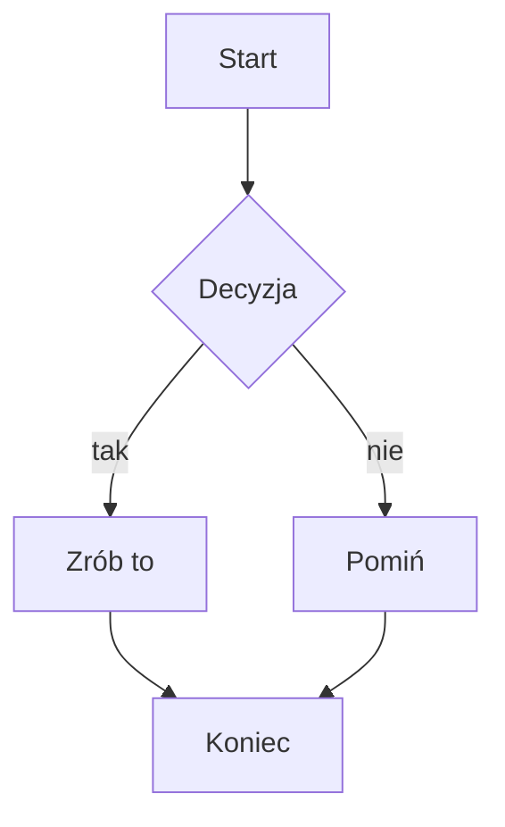
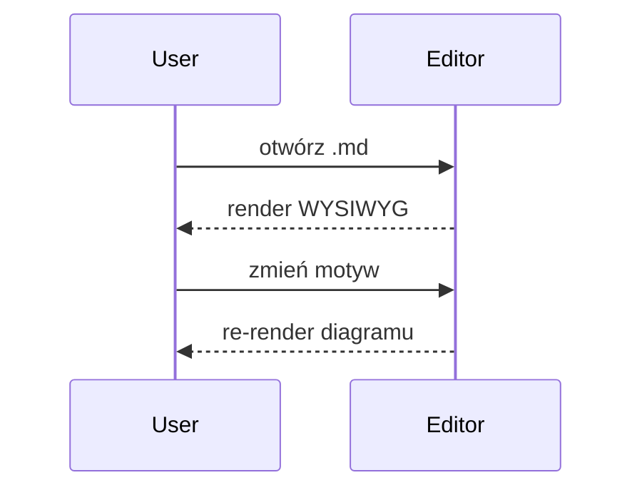
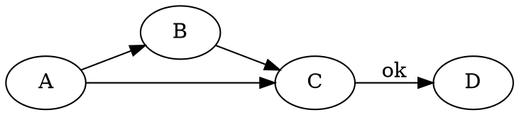
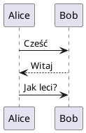

# vMarkd — wszystkie renderery

Plik demonstracyjny: każdy renderer Vditora + matematyka + podświetlanie kodu.
Otwórz w vMarkd i przełączaj `vmarkd.theme.content` / `vmarkd.theme.mermaid`,
żeby zobaczyć, co podąża za motywem, a co ma zaszyte kolory.

---

## 1. Tekst + inline code + podświetlanie składni

Zwykły akapit z `inline code` i **pogrubieniem**. Bloki kodu kolorowane przez
highlight.js (sparowane z motywem treści):

```js
function greet(name) {
  const msg = `Hello, ${name}!`
  return msg.toUpperCase()
}
```

```python
def fib(n):
    a, b = 0, 1
    for _ in range(n):
        a, b = b, a + b
    return a
```

> Cytat blokowy — sprawdza tło/bordery blockquote z palety motywu.

---

## 2. Matematyka (KaTeX) — dziedziczy `currentColor`

Inline: $E = mc^2$ oraz $\sum_{i=1}^{n} i = \frac{n(n+1)}{2}$.

Blok:

$$
\int_{-\infty}^{\infty} e^{-x^2}\,dx = \sqrt{\pi}
$$

---

## 3. Mermaid — pełne parowanie palety (task 86)





---

## 4. ECharts — śledzi binarnie dark/light (własny motyw 'dark')

```echarts
{
  "title": { "text": "ECharts demo" },
  "tooltip": {},
  "xAxis": { "type": "category", "data": ["Pon","Wt","Śr","Czw","Pt"] },
  "yAxis": { "type": "value" },
  "series": [{ "type": "bar", "data": [5, 20, 36, 10, 12] }]
}
```

---

## 5. Mindmap (ECharts tree) — wejście to markdown outline (lista)

```mindmap
- vMarkd
  - Renderery
    - mermaid
    - math
  - Motywy
```

---

## 6. Markmap — wejście to markdown outline (ignoruje motyw)

```markmap
# Root
## Gałąź A
- liść 1
- liść 2
## Gałąź B
- liść 3
### Pod-gałąź
- liść 4
```

---

## 7. flowchart.js — śledzi motyw treści

```flowchart
st=>start: Start
op=>operation: Zrób coś
cond=>condition: Tak czy nie?
e=>end: Koniec
st->op->cond
cond(yes)->e
cond(no)->op
```

---

## 8. Graphviz / Viz.js — DOT, bez motywu



---

## 9. PlantUML — offline TeaVM + SVG post-processing (task 87)



---

## 10. abc.js — notacja muzyczna ABC (bez motywu)

```abc
X:1
T:Gama C-dur
M:4/4
L:1/4
K:C
C D E F | G A B c |
```

---

## 11. smiles-drawer — struktura chemiczna (śledzi binarnie dark)

Kofeina:

```smiles
CN1C=NC2=C1C(=O)N(C(=O)N2C)C
```

---

## 12. WaveDrom — timing diagrams (task 101)

```wavedrom
{ "signal": [{ "name": "clk", "wave": "p......." }, { "name": "dat", "wave": "x.345x.." }, { "name": "req", "wave": "0.1..0.." }] }
```

---

## 13. nomnoml — UML diagrams (task 103)

```nomnoml
[Pirate|eyeCount: Int|raid();pillage()]
[Pirate] -> [Ship]
[Ship] -> [Treasure]
```

---

## 14. GeoJSON — interactive map, offline (task 99)

```geojson
{"type":"FeatureCollection","features":[{"type":"Feature","geometry":{"type":"Polygon","coordinates":[[[20.9,52.1],[21.1,52.1],[21.1,52.3],[20.9,52.3],[20.9,52.1]]]},"properties":{"name":"Warszawa"}}]}
```

---

## 15. TopoJSON — converted to GeoJSON + Leaflet (task 99)

```topojson
{"type":"Topology","objects":{"shape":{"type":"GeometryCollection","geometries":[{"type":"Polygon","arcs":[[0]]}]}},"arcs":[[[0,0],[1,0],[1,1],[0,1],[0,0]]]}
```

---

## 16. STL — 3D model, WebGL canvas (task 100)

```stl
solid triangle
 facet normal 0 0 1
  outer loop
   vertex 0 0 0
   vertex 1 0 0
   vertex 0.5 1 0
  endloop
 endfacet
 facet normal 0 0 -1
  outer loop
   vertex 0 0 0
   vertex 0.5 1 0
   vertex 1 0 0
  endloop
 endfacet
endsolid triangle
```

---

## 17. Tabela + lista zadań (palette content-theme)

| Renderer | Śledzi motyw? | Mechanizm |
|----------|:-------------:|-----------|
| math (KaTeX) | ✅ | dziedziczy `currentColor` |
| mermaid | ✅ | paleta (task 86) |
| ECharts | ✅ | paleta + gallery themes (task 89/90) |
| smiles | ✅ | foreground color (task 93) |
| markmap | ✅ | CSS vars `--markmap-*` (task 95) |
| graphviz | ✅ | SVG post-processing `currentColor` (task 94) |
| plantuml | ✅ | SVG post-processing `currentColor` (task 87) |
| flowchart | ✅ | foreground z motywu treści |
| abc | ✅ | foreground color (task 93) |
| wavedrom | ✅ | SVG post-processing `currentColor` (task 101) |
| nomnoml | ✅ | SVG post-processing `currentColor` (task 103) |
| geojson | ✅ | Leaflet style color z computed style (task 99) |
| topojson | ✅ | j.w. (task 99) |
| stl | ✅ | MeshPhongMaterial color z computed style (task 100) |

---

## 18. Callouts / GitHub Alerts (task 106)

5 typów GitHub:

> [!NOTE]
> Przydatna informacja, na którą użytkownik powinien zwrócić uwagę.

> [!TIP]
> Pomocna rada — jak zrobić coś lepiej.

> [!IMPORTANT]
> Kluczowa informacja niezbędna do sukcesu.

> [!WARNING]
> Treść wymagająca natychmiastowej uwagi (ryzyko).

> [!CAUTION]
> Ostrzeżenie o negatywnych skutkach.

Z własnym tytułem:

> [!WARNING] Uwaga na dane
> Ta operacja jest nieodwracalna.

Foldowalne (Obsidian `-`/`+`):

> [!tip]- Zwinięty domyślnie
> Ten tekst jest ukryty, dopóki nie rozwiniesz.

> [!note]+ Rozwinięty domyślnie
> Ten tekst jest widoczny od razu.

Zwykły blockquote (NIE callout — nie powinien dostać pudełka):

> To jest normalny cytat, bez markera `[!TYPE]`.

---

## 19. Komentarze HTML — widoczne w edytorze

<!-- Ten komentarz powinien być widoczny jako wyciszony tekst w IR, WYSIWYG i Preview. -->

<!-- TODO: dodać testy e2e dla nowych rendererów -->

<!--
Komentarz wieloliniowy:
- linia pierwsza
- linia druga
-->

Zwykły HTML block (NIE komentarz — powinien renderować się normalnie):

<div style="padding:8px; border:1px solid currentColor; border-radius:4px">
To jest zwykły blok HTML, nie komentarz.
</div>
