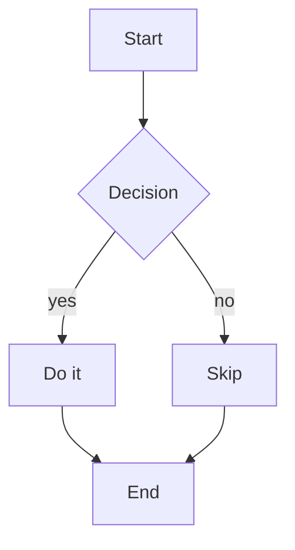
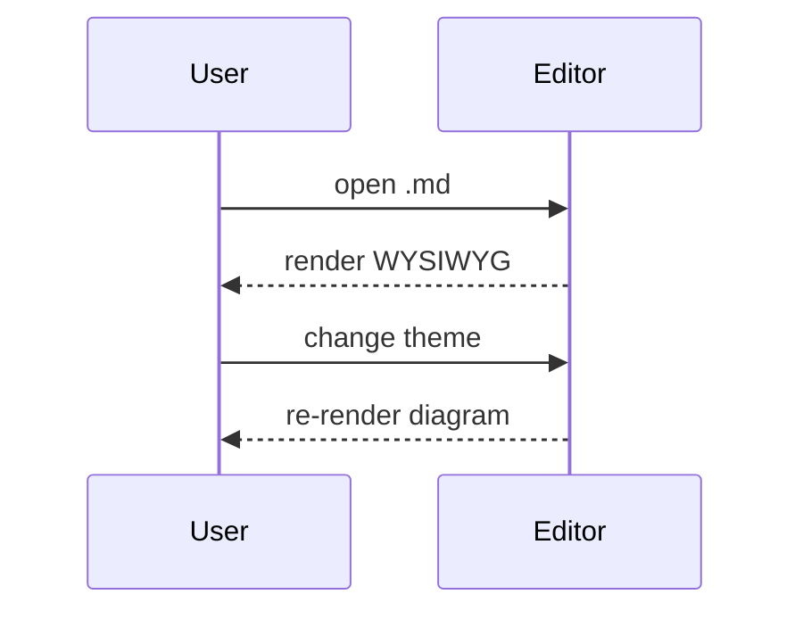
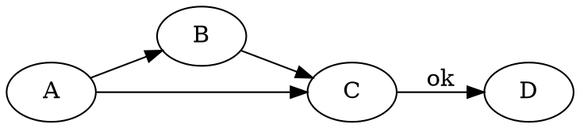
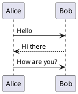

# vMarkd — All Renderers

Demo file: every Vditor renderer + math + syntax highlighting.
Open in vMarkd and toggle `vmarkd.theme.content` / `vmarkd.theme.mermaid`
to see which renderers follow the theme and which have baked colors.

---

## 1. Text + inline code + syntax highlighting

A regular paragraph with `inline code` and **bold text**. Code blocks are
colored by highlight.js (paired with the content theme):

```js
function greet(name) {
  const msg = `Hello, ${name}!`
  return msg.toUpperCase()
}
```

```python
def fib(n):
    a, b = 0, 1
    for _ in range(n):
        a, b = b, a + b
    return a
```

> Block quote — verifies blockquote background/borders from the theme palette.

---

## 2. Math (KaTeX) — inherits `currentColor`

Inline: $E = mc^2$ and $\sum_{i=1}^{n} i = \frac{n(n+1)}{2}$.

Block:

$$
\int_{-\infty}^{\infty} e^{-x^2}\,dx = \sqrt{\pi}
$$

---

## 3. Mermaid — full palette pairing (task 86)





---

## 4. ECharts — palette + gallery themes (task 89/90)

```echarts
{
  "title": { "text": "ECharts demo" },
  "tooltip": {},
  "xAxis": { "type": "category", "data": ["Mon","Tue","Wed","Thu","Fri"] },
  "yAxis": { "type": "value" },
  "series": [{ "type": "bar", "data": [5, 20, 36, 10, 12] }]
}
```

---

## 5. Mindmap (ECharts tree) — input is a markdown outline (list)

```mindmap
- vMarkd
  - Renderers
    - mermaid
    - math
  - Themes
```

---

## 6. Markmap — markdown outline, CSS var theming (task 95)

```markmap
# Root
## Branch A
- leaf 1
- leaf 2
## Branch B
- leaf 3
### Sub-branch
- leaf 4
```

---

## 7. flowchart.js — follows content theme

```flowchart
st=>start: Start
op=>operation: Do something
cond=>condition: Yes or no?
e=>end: End
st->op->cond
cond(yes)->e
cond(no)->op
```

---

## 8. Graphviz / Viz.js — DOT, SVG post-processing theme (task 94)



---

## 9. PlantUML — offline TeaVM + SVG post-processing (task 87)



---

## 10. abc.js — ABC music notation, foreground themed (task 93)

```abc
X:1
T:C Major Scale
M:4/4
L:1/4
K:C
C D E F | G A B c |
```

---

## 11. smiles-drawer — chemical structure, foreground themed (task 93)

Caffeine:

```smiles
CN1C=NC2=C1C(=O)N(C(=O)N2C)C
```

---

## 12. WaveDrom — timing diagrams (task 101)

```wavedrom
{ "signal": [{ "name": "clk", "wave": "p......." }, { "name": "dat", "wave": "x.345x.." }, { "name": "req", "wave": "0.1..0.." }] }
```

---

## 13. nomnoml — UML diagrams (task 103)

```nomnoml
[Pirate|eyeCount: Int|raid();pillage()]
[Pirate] -> [Ship]
[Ship] -> [Treasure]
```

---

## 14. GeoJSON — interactive map, offline / no tiles (task 99)

```geojson
{
  "type": "FeatureCollection",
  "features": [
    {
      "type": "Feature",
      "geometry": {
        "type": "Polygon",
        "coordinates": [[[20.85,52.15],[21.15,52.15],[21.15,52.35],[20.85,52.35],[20.85,52.15]]]
      },
      "properties": { "name": "Warsaw center" }
    },
    {
      "type": "Feature",
      "geometry": {
        "type": "LineString",
        "coordinates": [[20.9,52.2],[21.0,52.25],[21.1,52.22],[21.05,52.3]]
      },
      "properties": { "name": "Vistula river" }
    },
    {
      "type": "Feature",
      "geometry": { "type": "Point", "coordinates": [21.01,52.23] },
      "properties": { "name": "Old Town" }
    },
    {
      "type": "Feature",
      "geometry": { "type": "Point", "coordinates": [20.94,52.19] },
      "properties": { "name": "Airport" }
    }
  ]
}
```

---

## 15. TopoJSON — converted to GeoJSON + Leaflet (task 99)

```topojson
{
  "type": "Topology",
  "objects": {
    "regions": {
      "type": "GeometryCollection",
      "geometries": [
        { "type": "Polygon", "arcs": [[0]], "properties": { "name": "Region A" } },
        { "type": "Polygon", "arcs": [[1]], "properties": { "name": "Region B" } }
      ]
    }
  },
  "arcs": [
    [[0,0],[10,0],[10,10],[0,10],[0,0]],
    [[10,0],[20,0],[20,10],[10,10],[10,0]]
  ]
}
```

---

## 16. Vega / Vega-Lite — declarative data-viz (task 102)

Vega-Lite (high-level grammar):

```vega-lite
{
  "$schema": "https://vega.github.io/schema/vega-lite/v5.json",
  "data": { "values": [
    {"category":"A","value":28},{"category":"B","value":55},
    {"category":"C","value":43},{"category":"D","value":91},
    {"category":"E","value":81},{"category":"F","value":53}
  ]},
  "mark": "bar",
  "encoding": {
    "x": {"field":"category","type":"nominal","axis":{"labelAngle":0}},
    "y": {"field":"value","type":"quantitative"}
  },
  "width": 300,
  "height": 200
}
```

Full Vega (low-level grammar — same renderer; `$schema` selects the dialect):

```vega
{
  "$schema": "https://vega.github.io/schema/vega/v5.json",
  "width": 300,
  "height": 200,
  "padding": 5,
  "data": [
    {
      "name": "table",
      "values": [
        {"category":"A","amount":28},{"category":"B","amount":55},
        {"category":"C","amount":43},{"category":"D","amount":91},
        {"category":"E","amount":81},{"category":"F","amount":53}
      ]
    }
  ],
  "scales": [
    {
      "name": "xscale",
      "type": "band",
      "domain": {"data": "table", "field": "category"},
      "range": "width",
      "padding": 0.05
    },
    {
      "name": "yscale",
      "domain": {"data": "table", "field": "amount"},
      "nice": true,
      "range": "height"
    }
  ],
  "axes": [
    {"orient": "bottom", "scale": "xscale"},
    {"orient": "left", "scale": "yscale"}
  ],
  "marks": [
    {
      "type": "rect",
      "from": {"data": "table"},
      "encode": {
        "enter": {
          "x": {"scale": "xscale", "field": "category"},
          "width": {"scale": "xscale", "band": 1},
          "y": {"scale": "yscale", "field": "amount"},
          "y2": {"scale": "yscale", "value": 0}
        }
      }
    }
  ]
}
```

Three charts side by side — use **one** spec with `hconcat` (markdown can't put separate fenced
blocks in a row; the renderer makes one full-width block per fence). `vconcat` stacks, and
`concat` + `"columns": N` makes a grid:

```vega-lite
{
  "$schema": "https://vega.github.io/schema/vega-lite/v5.json",
  "data": {"values": [{"a":"X","b":4},{"a":"Y","b":7},{"a":"Z","b":2}]},
  "hconcat": [
    {"mark":"bar","width":110,"height":110,"encoding":{"x":{"field":"a","type":"nominal"},"y":{"field":"b","type":"quantitative"}}},
    {"mark":"line","width":110,"height":110,"encoding":{"x":{"field":"a","type":"nominal"},"y":{"field":"b","type":"quantitative"}}},
    {"mark":"point","width":110,"height":110,"encoding":{"x":{"field":"a","type":"nominal"},"y":{"field":"b","type":"quantitative"}}}
  ]
}
```

---

## 17. STL — 3D model, WebGL canvas (task 100)

```stl
solid cube
 facet normal 0 0 -1
  outer loop
   vertex 0 0 0
   vertex 1 1 0
   vertex 1 0 0
  endloop
 endfacet
 facet normal 0 0 -1
  outer loop
   vertex 0 0 0
   vertex 0 1 0
   vertex 1 1 0
  endloop
 endfacet
 facet normal 0 0 1
  outer loop
   vertex 0 0 1
   vertex 1 0 1
   vertex 1 1 1
  endloop
 endfacet
 facet normal 0 0 1
  outer loop
   vertex 0 0 1
   vertex 1 1 1
   vertex 0 1 1
  endloop
 endfacet
 facet normal 0 -1 0
  outer loop
   vertex 0 0 0
   vertex 1 0 0
   vertex 1 0 1
  endloop
 endfacet
 facet normal 0 -1 0
  outer loop
   vertex 0 0 0
   vertex 1 0 1
   vertex 0 0 1
  endloop
 endfacet
 facet normal 0 1 0
  outer loop
   vertex 0 1 0
   vertex 0 1 1
   vertex 1 1 1
  endloop
 endfacet
 facet normal 0 1 0
  outer loop
   vertex 0 1 0
   vertex 1 1 1
   vertex 1 1 0
  endloop
 endfacet
 facet normal -1 0 0
  outer loop
   vertex 0 0 0
   vertex 0 0 1
   vertex 0 1 1
  endloop
 endfacet
 facet normal -1 0 0
  outer loop
   vertex 0 0 0
   vertex 0 1 1
   vertex 0 1 0
  endloop
 endfacet
 facet normal 1 0 0
  outer loop
   vertex 1 0 0
   vertex 1 1 0
   vertex 1 1 1
  endloop
 endfacet
 facet normal 1 0 0
  outer loop
   vertex 1 0 0
   vertex 1 1 1
   vertex 1 0 1
  endloop
 endfacet
endsolid cube
```

---

## 18. D2 — compile-only WASM + dagre + currentColor (task 104)

A plain diagram (nodes, edge labels, a container, shaped nodes) renders to themed SVG:

```d2
direction: right
api: API
server: {shape: circle}
db: {shape: cylinder}
api -> server: request
server -> db: query
cluster: {
  worker_a
  worker_b
}
api -> cluster.worker_a
```

Styles (fill / stroke / stroke-width / opacity / border-radius), a SQL table, a UML class, and a grid:

```d2
styled: Styled {
  style: {fill: "#2b6cb0"; stroke: "#1a365d"; stroke-width: 3; border-radius: 8; opacity: 0.9}
}
users: {
  shape: sql_table
  id: int {constraint: primary_key}
  email: varchar
  org_id: int {constraint: foreign_key}
}
Animal: {
  shape: class
  +name: string
  -age: int
  +speak(): void
}
panel: {
  grid-columns: 2
  a; b; c; d
}
styled -> users
```

A bespoke-layout shape (`sequence_diagram`) is NOT faithfully renderable by dagre, so it falls
back LOUDLY to the raw source (never a silently-wrong picture):

```d2
shape: sequence_diagram
alice -> bob: hi
bob -> alice: hey
```

---

## 19. Theme coverage table

| Renderer | Themed? | Mechanism |
|----------|:-------:|-----------|
| math (KaTeX) | ✅ | inherits `currentColor` |
| mermaid | ✅ | palette pairing (task 86) |
| ECharts | ✅ | palette + gallery themes (task 89/90) |
| smiles | ✅ | foreground color (task 93) |
| markmap | ✅ | CSS vars `--markmap-*` (task 95) |
| graphviz | ✅ | SVG post-processing `currentColor` (task 94) |
| plantuml | ✅ | SVG post-processing `currentColor` (task 87) |
| flowchart | ✅ | foreground from content theme |
| abc | ✅ | foreground color (task 93) |
| wavedrom | ✅ | SVG post-processing `currentColor` (task 101) |
| nomnoml | ✅ | SVG post-processing `currentColor` (task 103) |
| geojson | ✅ | Leaflet style color from computed style (task 99) |
| topojson | ✅ | same as geojson (task 99) |
| vega / vega-lite | ✅ | vega-embed config (axis/label/title colors from computed style, task 102) |
| stl | ✅ | MeshPhongMaterial color from computed style (task 100) |
| d2 | ✅ | compile-only WASM + dagre + `currentColor` SVG (task 104) |

---

## 20. Callouts / GitHub Alerts (task 106)

5 GitHub types:

> [!NOTE]
> Useful information the user should be aware of.

> [!TIP]
> Helpful advice — how to do something better.

> [!IMPORTANT]
> Key information needed for success.

> [!WARNING]
> Content requiring immediate attention (risk).

> [!CAUTION]
> Warning about negative consequences.

With a custom title:

> [!WARNING] Watch your data
> This operation is irreversible.

A plain blockquote (NOT a callout — should not get a box):

> This is a regular quote, no `[!TYPE]` marker.

---

## 21. HTML comments — visible in the editor

<!-- This comment should be visible as muted text in IR, WYSIWYG, and Preview. -->

<!-- TODO: add e2e tests for new renderers -->

<!--
Multi-line comment:
- line one
- line two
-->

A plain HTML block (NOT a comment — should render normally):

<div style="padding:8px; border:1px solid currentColor; border-radius:4px">
This is a regular HTML block, not a comment.
</div>
