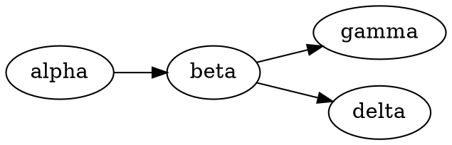

# Diagram edit-cycle monitor

A flowchart (flowchart.js — measures TEXT, so it must re-render visible) and a graphviz (computes its
layout headless — renders fine while hidden). The monitor edits each and watches the whole
debounce→settle→swap cycle: size stability, error appearance, and that the diagram still renders.

```flowchart
st=>start: Start
op=>operation: Do something
cond=>condition: Yes or no?
e=>end: End
st->op->cond
cond(yes)->e
cond(no)->op
```



after paragraph
