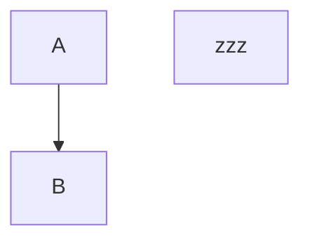
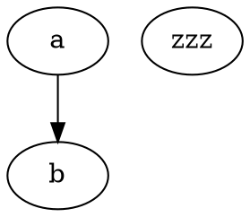

# Diagram edit-churn baseline (task 161)

Minimal one-block-per-engine fixture for the live-edit responsiveness measurement
(`d2-edit-perf.spec.ts`). Each block's LAST source line is a lone identifier `zzz` so the
spec can place the caret at its end and append letters — every keystroke stays
syntactically valid (an isolated node), so each engine actually re-renders per keystroke.

## d2 (custom-observer family — no debounce)

```d2
a -> b
zzz
```

## mermaid (vditor-native family)



## graphviz (vditor-native family)



## echarts (vditor-native family — canvas)

```echarts
{
  "title": { "text": "zzz" },
  "xAxis": { "type": "category", "data": ["A", "B", "C"] },
  "yAxis": { "type": "value" },
  "series": [{ "type": "bar", "data": [1, 2, 3] }]
}
```

## flowchart (vditor-native family — flowchart.js DSL)

```flowchart
st=>start: zzz
e=>end: End
st->e
```

## stl (custom-observer family — three.js / WebGL)

```stl
solid zzz
facet normal 0 0 0
  outer loop
    vertex 0 0 0
    vertex 1 0 0
    vertex 0 1 0
  endloop
endfacet
endsolid zzz
```
