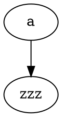

# Diagram error rides the settle gate (task 178 item 4)

A VALID graphviz diagram. The settle-gate e2e edits its source to break it and asserts the error box
appears only AFTER the edit settles (task-161 debounce), never synchronously mid-edit.

