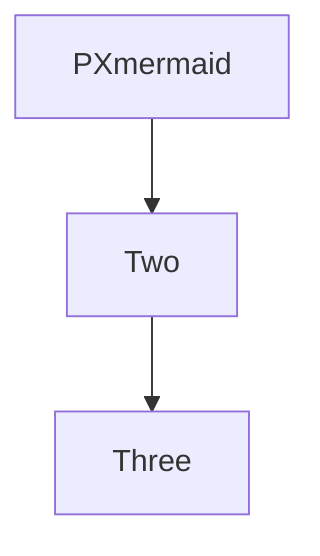

# Overlay diagram height

PXabove paragraph before the diagrams.


```mermaid
graph TD
  A[PXmermaid] --> B[Two]
  B --> C[Three]
```

PXbetween paragraph between the diagrams.

```d2
PXd2a -> PXd2b
PXd2b -> PXd2c
```

PXbelow paragraph after the diagrams.
