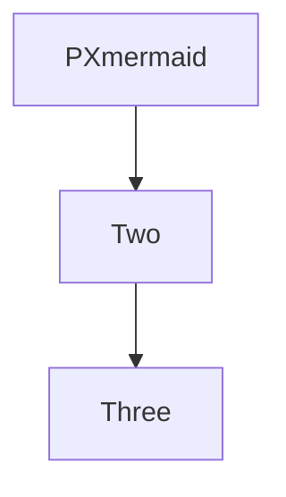

# PXh1x heading level 1

## PXh2x heading level 2

### PXh3x heading level 3

#### PXh4x heading level 4

##### PXh5x heading level 5

###### PXh6x heading level 6

PXpara first line of a soft-wrapped paragraph that keeps going for a while
second line of the same paragraph with a few more words to wrap
third line continues the very same paragraph a little longer still
fourth line adds yet another run of ordinary words to the text
fifth line closes it.

PXbreak line one  
line two after a hard break.

Inline **PXbold** text.

Inline *PXem* text.

Inline ~~PXstrike~~ text.

Inline `PXicode` text.

Inline [PXlink](https://example.com/) text.

Inline <https://example.org/PXauto> text.

Inline  image.

- PXtight one
- PXtight two
- PXtight three

* PXloose one

* PXloose two

* PXloose three

+ PXnest outer one

  - PXnest inner a
  - PXnest inner b

+ PXnest outer two

1. PXordered one
2. PXordered two
3. PXordered three

- [ ] PXtask open
- [x] PXtask done

> PXquote plain blockquote whose first line is rather long indeed
> second line of the quote also keeps running past the first wrap
> third line of the quote.

> PXqnest outer
>
> > PXqnest inner

> [!NOTE]
> PXcnote body of a note callout.

> [!TIP] PXctitle custom title
> Body of a titled tip callout.

```ts
// PXfence
const a: number = 1
function f(x: number) {
  return x + a
}
```

Text before an indented block.

    PXindent code line

Inline math $PXimath$ in a sentence.

$$
PXbmath = 1
$$

| PXtable A | B | C |
| :-- | :-: | --: |
| left | center | right |
| one | two | three |

***

Footnote reference PXfnref[^pxfn] in prose.

<!-- PXcomment hidden note -->

<div>PXhtml raw html block</div>

See [[PXwiki]] for a wiki-style link.

Reference `src/foo.ts:42` in code.



```d2
PXd2a -> PXd2b
```

PXclose closing paragraph of the canonical document.

[^pxfn]: PXfndef the footnote definition.
