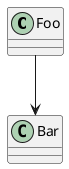
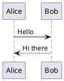

# PlantUML engine stickiness probe

First a CLASS diagram, then a SEQUENCE diagram — same shared TeaVM engine, two sequential render() calls.

```plantuml
@startuml
class Foo
class Bar
Foo --> Bar
@enduml
```

```plantuml
@startuml
Alice -> Bob: Hello
Bob --> Alice: Hi there
@enduml
```
