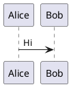

# PlantUML resize fixture

A small plantuml diagram (natural width < 300px) so the live `min-width:300px` engages —
exercising the keep-last overlay size-match (the diagram must not shrink/jump while editing).

